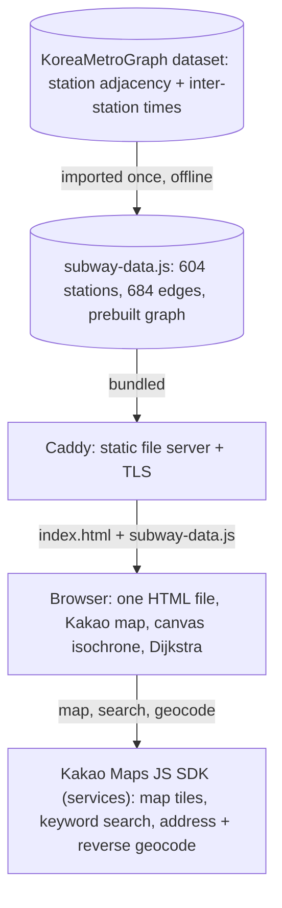

# Seoul Commute

A transit isochrone map for the Seoul metropolitan area. You drop a pin anywhere in the region and it draws the area you can reach by subway and walking within 30, 45, or 60 minutes, tints that reachable area on the map, and marks every station you can get to. It is meant for the "where could I live and still make this commute" question, answered at a glance rather than one route at a time.

**Live: https://tonggeun.clayborne.dev** (no account, works on first load).

This app is a port of [Melbourne Commute](https://tonggeun-mel.clayborne.dev). The two share one reachability engine; this repo's README focuses on what the Seoul version changed and why. For the deep write-up of the shared engine and the Melbourne data pipeline, read the [Melbourne repo's README](https://tonggeun-mel.clayborne.dev). See [What the port changed](#what-the-port-changed) below for the differences in one place.

<!-- SCREENSHOT / DEMO GIF GOES HERE -->
> **Demo placeholder:** add a screenshot of a 45-minute reachable area drawn around a station, plus a short GIF of tapping the map to move the origin.

## What it does

- Set an origin by tapping the map, dragging the pin, or searching a place or address.
- Pick a reach time: 30, 45, or 60 minutes. The reachable area redraws immediately.
- The tinted area is a real isochrone. Its shape follows the rail network, so it reaches far along subway lines and stays tight away from them.
- Every reachable station shows as a dot; tap one for its door-to-door time.
- A walk-distance slider (400 m to 2 km) sets how far you are willing to walk at each end.
- Bilingual (Korean and English), light and dark themes, remembers your last origin. The default origin is Seoul Station.

## Architecture

The whole app is two static files: the page and a prebuilt rail graph. There is no application server and no build step. The map, search, and geocoding all come from the Kakao Maps SDK loaded in the browser.



The graph loads as a plain JavaScript object with no fetch and no parse at runtime, so the first isochrone appears without waiting on a network call. The only live dependency is the Kakao SDK, and the app degrades gracefully when it is not available (see below).

## Computing the reachable area

Origin in, reachable area out. Unlike Melbourne, Seoul runs a single tier: the local graph approximation. There is no live-timetable refinement layer.

```mermaid
sequenceDiagram
    actor User
    participant App as Single-page app
    participant Graph as In-memory graph (Dijkstra)
    participant Canvas as Isochrone canvas
    participant Kakao as Kakao Maps SDK

    User->>App: pick an origin (tap map or Kakao search)
    App->>Graph: seed every station within access time of the origin
    Note over Graph: access = min(walk, bus wait + bus); flat 5-min transfer, no headway data
    Graph->>Graph: Dijkstra over station-line nodes
    Graph-->>App: arrival minute for every reachable station
    App->>Kakao: project lat/lng of origin and stations to screen points
    App->>Canvas: paint egress discs, blur, threshold to a contour
    Canvas-->>User: isochrone for the chosen band + station dots
```

**Getting onto the network (access).** The engine measures the straight-line distance from the origin to every station and turns it into an access time: the faster of walking (4.5 km/h) or a feeder bus (a fixed wait plus 16 km/h). Any station within the access cap becomes a seed for the search. Because the Seoul dataset has no headway data, seeds start with no first-vehicle wait, unlike Melbourne. If nothing is in range, the nearest station is connected anyway so the map is never empty.

**The shortest-path search.** The network is a graph where each node is a station on a specific line, so an interchange served by several lines appears once per line. Edges between consecutive stations carry the inter-station time from the dataset, and transfer edges join the per-line copies of one station at a flat five-minute penalty. A Dijkstra search on a binary min-heap produces the arrival minute for every node, collapsed to one arrival time per station.

**Drawing the area (egress).** The tinted shape is everywhere you can walk from a reachable station in the time you have left. For the active band, the renderer draws a filled disc at the origin and at each reachable station, sized by the walking distance still possible after arriving. The discs are painted onto an offscreen canvas, blurred, and run through a smoothstep threshold so their union becomes one clean, anti-aliased contour, with an edge pass drawing the boundary line and a fainter bus-reach halo underneath. The canvas is redrawn on every map pan and zoom, projected through Kakao's coordinate system, and fades out during a drag to keep panning smooth, then repaints when the map settles.

## What the port changed

The reachability engine (access model, Dijkstra over station-line nodes, and the paint-blur-threshold isochrone renderer) is carried over from Melbourne unchanged. Four things are different, and each follows from either the data or the country:

- **Data source: a prebuilt graph, not a GTFS pipeline.** Melbourne derives its graph from the official PTV GTFS timetable feed with a Python build script that removes express skip-edges and computes median travel times and per-line headways. Seoul has no such pipeline. Its graph comes ready-made from the [KoreaMetroGraph](https://github.com/ledyx/KoreaMetroGraph) dataset (crawled from Seoul Metro and wiki sources), imported once as `subway-data.js`. It gives station adjacencies and inter-station times but no headways and no train/tram split, so the Seoul engine drops the first-vehicle wait and uses a flat transfer penalty. That is the single largest behavioural difference between the two apps.

- **Map provider: Kakao instead of Leaflet.** Google Maps is not fully accurate inside Korea for legal and data reasons, and Kakao is the local standard. The Melbourne version's Leaflet map, CARTO tiles, and Leaflet projection are replaced by the Kakao Maps SDK: Kakao renders the map, and the isochrone canvas projects through Kakao's `getProjection` rather than Leaflet's. The reachable-station dots are Kakao custom overlays layered above the canvas so they stay clickable and are not tinted by the isochrone.

- **Search and geocoding: Kakao services, not the OSM chain.** Melbourne searches through a keyless chain of Google (proxied), Photon, and Nominatim. Seoul uses the Kakao `services` library end to end: keyword search for places, address search as a fallback, and reverse geocoding for the origin label, all biased to a Seoul-area bounding box. There is no server-side proxy, because the Kakao JS key is a public, domain-restricted key that is safe in the client.

- **No live-timetable layer.** Melbourne refines its local estimate with a background call to the Transitous routing service. Seoul has no equivalent, so what you see is the local graph approximation only.

**Graceful failure for Kakao.** The Kakao JS key is restricted to registered domains in the Kakao developer console. If the map service is not enabled or the domain is not registered, the SDK never initialises. Rather than showing a broken page, the app detects this (both an error and a load-timeout path) and shows a small card explaining that Kakao Maps needs to be enabled, so the failure mode is legible instead of a blank screen. The engine and graph are correct regardless; only the rendering waits on Kakao.

## Tech stack

**Client:** one hand-written `index.html`, no framework and no build step. The Kakao Maps SDK for the map, search, and geocoding; a canvas overlay for the isochrone; and plain JavaScript for the graph, the Dijkstra search, and the contour renderer. Styling is CSS custom properties with light and dark themes. Origin, chosen band, walk distance, theme, and language persist in localStorage.

**Data:** `subway-data.js`, a single prebuilt graph object imported from the KoreaMetroGraph dataset.

**Hosting:** a fully static Caddy site with automatic TLS. No dynamic routes.

## Running locally

No build, no dependencies, no server. Serve the folder with any static file server:

```bash
python3 -m http.server 8000
# then open http://localhost:8000
```

The map, search, and geocoding need the Kakao SDK to load, which requires the site domain to be registered against the Kakao JS key in the Kakao developer console. On a domain the key does not allow, the app shows the "enable Kakao Maps" card; the reachability engine itself still runs.

## Limitations and roadmap

- **No headway model.** The source dataset has no frequency data, so the estimate assumes a train is waiting when you arrive at a station. A real first-train wait would make outer, low-frequency lines more honest, but that would need headway data the current source does not carry.
- **No live-timetable refinement.** Seoul has no counterpart to Melbourne's Transitous layer, so it does not correct for real transfers and frequencies. Adding a Korean live-routing source is the main way this app would catch up to the Melbourne version.
- **Feeder buses are a model, not real routes.** Bus access is approximated with a fixed speed and wait rather than real bus lines.
- **The isochrone boundary is a walking radius, not a street network.** Discs are drawn as-the-crow-flies from each reachable station, so the contour can reach slightly across a river or a cutting a pedestrian cannot.
- **Kakao activation is a deployment prerequisite.** The map only renders where the JS key's domain restrictions allow it.
- **No automated tests.** The Dijkstra search and the contour renderer are the parts most worth covering first.

## Related

- [Melbourne Commute](https://tonggeun-mel.clayborne.dev), the canonical original this app was ported from, with the full GTFS-to-graph build pipeline (express removal, median timings, measured headways) and a live-timetable refinement layer.
